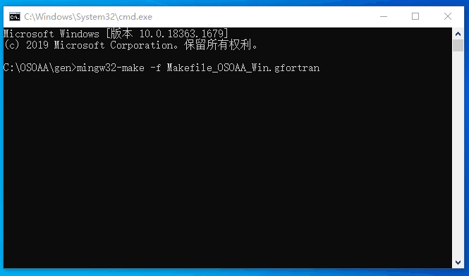

# OSOAA Windows Version
This is the Windows version of the OSOAA code, which can be run under Windows.

Note: This repo does not include OSOAA documents and JAVA GUI, please refer to 
[CNES|RadiativeTransferCode-OSOAA] for details.
# Installation
## Install MSYS2
[MSYS2] includes Mingw-w64, you can use the `make` command to compile gfortran files.

Add `msys64\mingw64\bin` to system environment variables

## Compile the gfortran file
Change to `OSOAA/gen`, call the command.

```mingw32-make -f Makefile_OSOAA_Win.gfortran```



[CNES|RadiativeTransferCode-OSOAA]:https://github.com/CNES/RadiativeTransferCode-OSOAA
[MSYS2]:https://www.msys2.org/